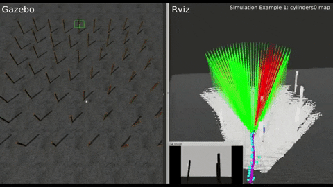

# Tentabot: Reactive Navigation Framework for Mobile Robots by Heuristically Evaluated Pre-sampled Trajectories (Tentacles)

[](https://youtu.be/5vZSEuWUXe4) [](https://youtu.be/5vZSEuWUXe4)

### 1. Related Papers
* N. Ü. Akmandor and T. Padır. "**Reactive navigation framework for mobile robots by heuristically evaluated pre-sampled trajectories**," International Journal of Robotic Computing 3.1 (2021): 47-68, [[DOI:10.35708/RC1870-126265]](https://b5589c9e-f1e3-4455-9929-0d78781398a4.filesusr.com/ugd/e49175_ccc84165293e42f79a1d4ad98260e8b9.pdf). [[arXiv:10.35708/RC1870-126265]](https://arxiv.org/abs/2105.08145)
* N. Ü. Akmandor and T. Padir, "**A 3D Reactive Navigation Algorithm for Mobile Robots by Using Tentacle-Based Sampling**," 2020 Fourth IEEE International Conference on Robotic Computing (IRC), Taichung, Taiwan, 2020, pp. 9-16, [[DOI:10.1109/IRC.2020.00009]](https://doi.org/10.1109/IRC.2020.00009). [[arXiv:2001.09199]](https://arxiv.org/abs/2001.09199).
* Von Hundelshausen, Felix, et al. "**Driving with tentacles: Integral structures for sensing and motion**." Journal of Field Robotics 25.9 (2008): 640-673, [[DOI:10.1002/rob.20256]](https://doi.org/10.1002/rob.20256).
* Usenko, Vladyslav, et al. "**Real-time trajectory replanning for MAVs using uniform B-splines and a 3D circular buffer**." 2017 IEEE/RSJ International Conference on Intelligent Robots and Systems (IROS). IEEE, 2017. [[DOI:10.1109/IROS.2017.8202160]](https://doi.org/10.1109/IROS.2017.8202160) [[arXiv:1703.01416]](https://arxiv.org/abs/1703.01416).

### 2. Videos

* [[IRC 2020 - supplementary video]](https://www.youtube.com/watch?v=5vZSEuWUXe4&t)
* [[IRC 2020 - presentation]](https://youtu.be/Y5FCiJPXmlo)

### 3 Installation

The system has been tested with Ubuntu 16.04 (ROS Kinetic) and 18.04 (ROS Melodic).

Follow the tutorials to
- [install ROS](http://wiki.ros.org/ROS/Installation) based on the Ubuntu version.
- [set up catkin workspace](http://wiki.ros.org/ROS/Tutorials/InstallingandConfiguringROSEnvironment).

#### 3.a Install required packages into the src folder:

Follow the instructions and [install ewok if the ROS version is either Melodic](https://github.com/VladyslavUsenko/ewok/tree/master). Changing the branch, [install ewok if the ROS version is Kinetic](https://github.com/VladyslavUsenko/ewok/tree/ubuntu_16_04_kinetic).

#### 3.b Install tentabot package into the src folder:
```
cd ~/catkin_ws/src
git clone https://github.com/RIVeR-Lab/tentabot.git
```

#### 3.c (optional) Install dependencies using rosdep tool:

Follow the Prerequisites instructions and install rosdep tool based on the ROS version: [Melodic rosdep](http://wiki.ros.org/melodic/Installation/Source).

ROS Melodic example of installing dependencies using rosdep tools:
```
cd ~/catkin_ws
rosdep install --from-paths src --ignore-src --rosdistro melodic -y
```

#### 3.d Build the catkin workspace:
```
cd ~/catkin_ws
catkin build
```

#### 3.e Source the workspace, after successfully built:
```
source devel/setup.bash
```

### 4. Simulation example

In separate terminal windows:

Start roscore:
```
roscore
```

Start visualization in Rviz:
```
roscd tentabot/rviz/
rviz -d simulation.rviz
```

Launch the system and Gazebo simulator:
```
roslaunch tentabot tentabot_go_cylinder.launch
```
OR
```
roslaunch tentabot tentabot_go_forest.launch
```

### 6. Credentials
Tentabot was developed at the [RIVeR Lab, Northeastern University](http://robot.neu.edu/).
