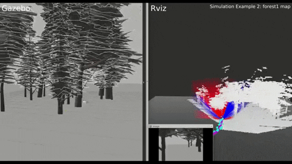
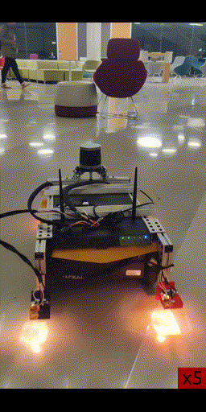

# Tentabot-DRL: Deep Reinforcement Learning based Robot Navigation in Dynamic Environments using Occupancy Values of Motion Primitives
     

# Tentabot-Heuristic: Reactive Navigation Framework for Mobile Robots by Heuristically Evaluated Pre-sampled Trajectories (Tentacles)
[](https://youtu.be/5vZSEuWUXe4) [](https://youtu.be/5vZSEuWUXe4)

### 1. Citation
```
@inproceedings{akmandor2022deep,
  title={Deep reinforcement learning based robot navigation in dynamic environments using occupancy values of motion primitives},
  author={Akmandor, Ne{\c{s}}et {\"U}nver and Li, Hongyu and Lvov, Gary and Dusel, Eric and Padir, Ta{\c{s}}kin},
  booktitle={2022 IEEE/RSJ International Conference on Intelligent Robots and Systems (IROS)},
  pages={11687--11694},
  year={2022},
  organization={IEEE}
}
```

```
@article{akmandor2021reactive,
  title={Reactive navigation framework for mobile robots by heuristically evaluated pre-sampled trajectories},
  author={Akmandor, Ne{\c{s}}et {\"U}nver and Padir, Ta{\c{s}}kin},
  journal={International Journal of Robotic Computing},
  volume={3},
  number={1},
  pages={47--68},
  year={2021}
}
```
```
@inproceedings{akmandor20203d,
  title={A 3d reactive navigation algorithm for mobile robots by using tentacle-based sampling},
  author={Akmandor, Ne{\c{s}}et {\"U}nver and Padir, Ta{\c{s}}kin},
  booktitle={2020 Fourth IEEE International Conference on Robotic Computing (IRC)},
  pages={9--16},
  year={2020},
  organization={IEEE}
}
```

### 2. Related Papers
* Akmandor, N. Ü., Li, H., Lvov, G., Dusel, E., & Padir, T. (2022, October). **Deep reinforcement learning based robot navigation in dynamic environments using occupancy values of motion primitives**. In 2022 IEEE/RSJ International Conference on Intelligent Robots and Systems (IROS) (pp. 11687-11694). IEEE. [[DOI:10.1109/IROS47612.2022.9982133]](https://ieeexplore.ieee.org/document/9982133), [[arXiv:2208.08034]](https://arxiv.org/abs/2208.08034).
* Akmandor, N. Ü. and Padır, T. (2021). **Reactive navigation framework for mobile robots by heuristically evaluated pre-sampled trajectories**. International Journal of Robotic Computing, 3(1), 47-68. [[DOI:10.35708/RC1870-126265]](https://b5589c9e-f1e3-4455-9929-0d78781398a4.filesusr.com/ugd/e49175_ccc84165293e42f79a1d4ad98260e8b9.pdf), [[arXiv:10.35708/RC1870-126265]](https://arxiv.org/abs/2105.08145)
* Akmandor, N. Ü., & Padir, T. (2020, November). **A 3d reactive navigation algorithm for mobile robots by using tentacle-based sampling**. In 2020 Fourth IEEE International Conference on Robotic Computing (IRC) (pp. 9-16). IEEE. [[DOI:10.1109/IRC.2020.00009]](https://doi.org/10.1109/IRC.2020.00009), [[arXiv:2001.09199]](https://arxiv.org/abs/2001.09199).
* Von Hundelshausen, F., Himmelsbach, M., Hecker, F., Mueller, A., & Wuensche, H. J. (2008). **Driving with tentacles: Integral structures for sensing and motion**. Journal of Field Robotics, 25(9), 640-673. [[DOI:10.1002/rob.20256]](https://doi.org/10.1002/rob.20256).

### 2. Videos
* [[IRC 2020 - supplementary video]](https://www.youtube.com/watch?v=5vZSEuWUXe4&t)
* [[IRC 2020 - presentation]](https://youtu.be/Y5FCiJPXmlo)

### 3 Installation
The system has been tested with 20.04 (ROS Noetic).

Follow the tutorials to
- [install ROS](http://wiki.ros.org/ROS/Installation) based on the Ubuntu version.
- [set up catkin workspace](http://wiki.ros.org/ROS/Tutorials/InstallingandConfiguringROSEnvironment).

To install tentabot, either follow the [manual installation instructions](docs/MANUAL_INSTALLATION.md), or attempt an automated install with the following instructions (experimental):

#### 3.1 Clone the tentabot repository into the src folder of your catkin workspace, and change into the tentabot directory.
```
git clone https://github.com/RIVeR-Lab/tentabot.git
cd tentabot
```
#### 3.2 Run the bash script to automate installing all dependencies.
##### Note: This script requires superuser and makes system changes. Review the script before running.
```
chmod +x install_tentabot.sh
./install_tentabot.sh
```

#### 3.3 Source the workspace, after successfully built.
```
source devel/setup.bash
```

### 4. Simulation
Tentabot features out of the box simulation support for certain robots. You can view the status of this support here:

| Robot / Model| Manufacturer | Simulation | Real | Methods |
|:- |:- |:- |:- |:- |
| Turtlebot 3 / Burger | [Robotis](https://www.robotis.us/turtlebot-3/) | :heavy_check_mark:|❌| heuristic/drl | 
| Firefly | AscTec | :heavy_check_mark: |❌| heuristic/drl |
| ROSbot | [Husarion](https://husarion.com/manuals/rosbot/) | :heavy_check_mark: | ❌ | heuristic/drl |
| Stretch | [Hello Robot](https://hello-robot.com/) | :heavy_check_mark: | :heavy_check_mark: | heuristic/drl | 
| Jackal | [Clearpath Robotics](https://clearpathrobotics.com/jackal-small-unmanned-ground-vehicle/) | :heavy_check_mark: | :heavy_check_mark: | heuristic |
| Turtlebot 2 | [Turtlebot](https://www.turtlebot.com/) | ❌ | :heavy_check_mark: | heuristic/drl |

Tentabot navigation framework is formed by several submodules such as:
##### a. Simulation Environment (Gazebo)
##### b. Data Visualization (Rviz)
##### c. Map Utility Server
- Subscribes to sensor messages (supports [PointCloud2](http://docs.ros.org/en/lunar/api/sensor_msgs/html/msg/PointCloud2.html) and [LaserScan](http://docs.ros.org/en/melodic/api/sensor_msgs/html/msg/LaserScan.html)).
- Publishes an occupancy map in [octomap_msgs](https://wiki.ros.org/octomap_msgs) format.
##### d. Tentabot Server
##### e. Tentabot DRL (Training / Testing)

#### 4.1 Configure the configuration files located in:
- [task_nav](config/task_nav): World, goal and robot specific parameters. Example: [Turtlebot3](config/task_nav/config_task_nav_turtlebot3.yaml)
- [map_utility](config/map_utility): User defined local map features and sensor specific parameters. Example: [Turtlebot3](config/map_utility/config_map_utility_turtlebot3.yaml).
- [tentabot_server](config/tentabot_server): User defined Tentabot algorithm parameters. Example: [Turtlebot3](config/tentabot_server/config_tentabot_server_turtlebot3.yaml).

##### 4.1.1 To enable Tentabot DRL, set "drl_service_flag: true" in the Tentabot Server configuration file.
##### 4.1.2 Set the "mode" parameter in the Tentabot Server configuration file as either "training" or "testing".
##### 4.1.3 To continue "training" or start "testing", set the "initial_training_path" parameter in the Tentabot Server configuration file by providing the location of a trained model.

#### 4.2 Open the [tentabot_framework.launch](launch/tentabot_framework.launch) file.
##### 4.2.1 Configure the submodule flags.
| Argument | Description |
|:- |:- |
| sim_flag | If True, it launches Gazebo simulation. |
| rviz_flag | If True, it launches Rviz for data visualization. |
| map_utility_flag | If True, it runs the Map Utility Server. |
| tentabot_server_flag | If True, it launches the Tentabot Server. |

##### 4.2.2 Set the names of configuration files.
| Argument | Examples | File Location |
|:- |:- |:- |
| config_task_name  | config_task_nav_cylinders0_firefly, config_task_nav_forestX_firefly, config_task_nav_turtlebot3, config_task_nav_stretch, config_task_nav_jackal, config_task_nav_jackal_real, config_task_nav_rosbot | [task_nav](config/task_nav) |
| config_map_utility | config_map_utility_cylinders0_firefly, config_map_utility_forestX_firefly, config_map_utility_turtlebot3, config_map_utility_stretch, config_map_utility_jackal, config_map_utility_jackal_real, config_map_utility_rosbot | [map_utility](config/map_utility) |
| config_tentabot_server | config_tentabot_server_firefly, config_tentabot_server_turtlebot3, config_tentabot_server_stretch, config_tentabot_server_jackal, config_tentabot_server_jackal_real, config_tentabot_server_rosbot| [tentabot_server](config/tentabot_server) |

#### 4.3 Run the Tentabot Framework launch file in a terminal window:
```
roslaunch tentabot tentabot_framework.launch
```

### 5. Real Robot
We tested our framework in real robot platforms including Turtlebot2, Stretch and Jackal.
 
#### 5.1 Run the robot bring-up (Example: [Jackal](launch/others/robot_bringup/jackal/jackal_bringup.launch)) which includes:
- publishing robot's links and joint state info
- launching sensor drivers.

#### 5.2 Run a localization estimation algorithm (Example: [ROS Gmapping](launch/others/gmapping/gmapping_jackal.launch)).

#### 5.3 Follow all steps in the previous section noting that in step 4.2.1, set the "sim_flag" argument as False in [tentabot_framework.launch](launch/tentabot_framework.launch) file.

### 6. Contributors
Neset Unver Akmandor | akmandor.n@northeastern.edu \
Eric Dusel | dusel.e@northeastern.edu \
Gary Lvov | lvov.g@northeastern.edu | www.garylvov.com \
Hongyu Li | li.hongyu1@northeastern.edu

### 7. Credentials
Tentabot was developed at the [RIVeR Lab, Northeastern University](http://robot.neu.edu/).
